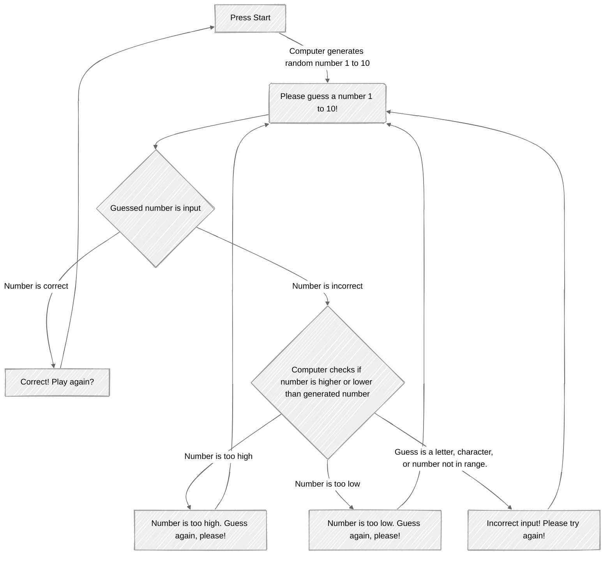

# WalterLaw2025.github.io
Name: Walter Law
Email: wllaw@my.waketech.edu
This is my school account.
Description: This repository will hold assignments.
# About Me
## Interests I Have
* Anime
     * Anime I Currently Watch
  1. One Piece
  2. Solo Leveling
  3. Fire Force *(Rewatching to prepare for the new season.)*
* Video Games
     * Systems I Play On
  1. PS5
  2. XBox One
  3. Nintendo Switch
* Food and Restuarants
     * Korean BBQ
     * Sushi
     * Latin

## Recommended Websites
* [Crunchyroll Anime Website](https://www.crunchyroll.com/) - This is where I watch most of the anime I like.

* [Gamestop Website](https://www.gamestop.com/) - Some of my games are bought from here, though most are bought from in the store.
* Eat Happy, Be Happy
     * [KPot Korean BBq](https://thekpot.com/) - This is definitely one of my favorite places to eat. It is really good for groups but I also like to come by myself and even watch a little anime or other shows while savoring the delicious food.
     * [Okome House - Sushi](https://www.okomehouse.com/) - A restuarant that has quickly become a frequent lunch spot. The food is always fresh and for a good price. *I am currently trying to make my way through each item on the menu.*
     * [Yelp for Kumbala Sports Bar](https://www.yelp.com/biz/kumbala-bar-and-grill-raleigh) - A place that most would pass up but definitely has good food. The beans are the best I have had tasted in the area and they have other good selections too.

## Guessing Game

## This is a diagram of the flow of a guessing game. It shows how a player plays a guessing game and what happens when the computer responds to different inputs from the player.
